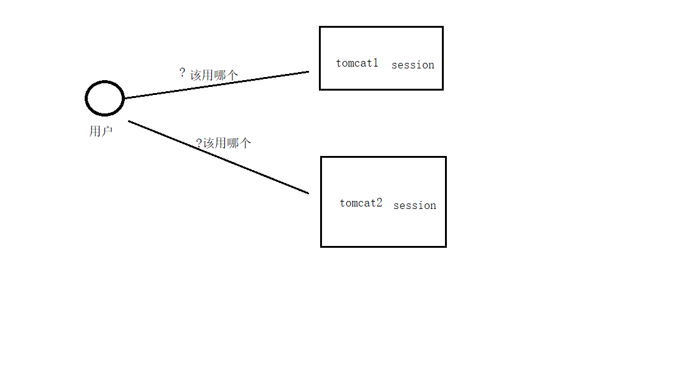
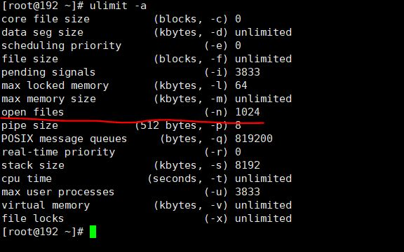
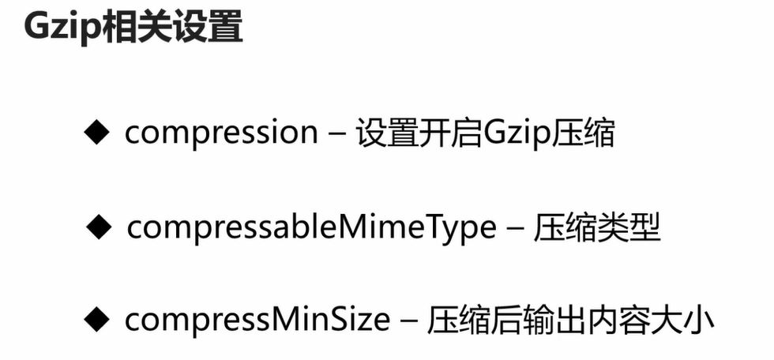
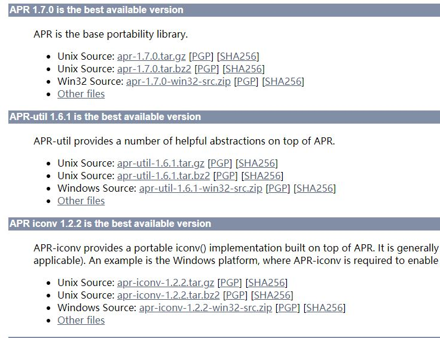

#  Tomcat集群

## Tomcat初步集群

对于用户来说

1不知道登录哪个服务器(负载均衡nginx)

2如果用户登录了一个服务器，那么如果访问另外一个服务器，是否还需要登录Session是否共享?



### 初步集群

#### 1在集群之前必须配置jdk

​	1.1解压jdk

​	1.2配置*vim /etc/profile*

​			按i进入编辑，在profile文件尾部添加如下内容

```

export JAVA_HOME=/usr/local/jdk1.8.0_181  #jdk安装目录
 
export JRE_HOME=${JAVA_HOME}/jre
 
export CLASSPATH=.:${JAVA_HOME}/lib:${JRE_HOME}/lib:$CLASSPATH
 
export JAVA_PATH=${JAVA_HOME}/bin:${JRE_HOME}/bin
 
export PATH=$PATH:${JAVA_PATH}

```

​	1.3*source /etc/profile* 使配置立刻生效

#### 2配置集群tomcat

​	1解压一个个tomcat,另外一个我们在cp一个tomcat

​	 2配置tomcat/tomcat2中的server.xml。这里示例tomcat2

```
/usr/local/tomcat2/conf/server.xml

```

在connector 中配置URIEncoding="UTF-8"

```xml
 <Connector port="8080" protocol="HTTP/1.1"
               connectionTimeout="20000"
               redirectPort="8443" URIENcoding="UTF-8" />

```

#### 3配置端口

1改变server port

​	变成9005

```xml
<Server port="9005" shutdown="SHUTDOWN">
  <Listener className="org.apache.catalina.startup.VersionLoggerListener" />
```

2 port变成9080其他不要动

```xml
<Connector port="9080" protocol="HTTP/1.1"
               connectionTimeout="20000"
               redirectPort="8443" URIENcoding="UTF-8" />

```

3改变AJP中的端口我们也变成9009,tomcat9，8默认是注释了

```xml
 <Connector protocol="AJP/1.3"
               address="::1"
               port="9009"
               redirectPort="8443" />

```


#### 4启动tomcat看是否成功

```
curl http://192.168.6.128:8080 
```

如果有html就说明本地启动成功。

#### 5坑

​		1本地启动成功，但是外边访问不了

​			多半都是防火墙惹的火，解决方法，要么关闭防火墙，要们在防火墙中配置8080端口

```
systemctl status firewalld.service
```

​	关闭防火墙

```
systemctl stop firewalld.service
```

禁止防火墙重启启动

```
systemctl disable firewalld.service 
```

# Tomcat优化

思路:

请求发送到tomcat容器，------->（检查线程池是否有足够线程）------------>有的话，从线程池中分配一个线程处理业务请求A，如果线程池没有线程的话，请求B会被放到线程队列中(找个小本记下来)，如果线程队列都满了，没有了，那只有异常了。


优化思路：

1线程池优化（Tomcat容器里）

2请求队列数量优化增大

3业务线程数量增大或者让业务线程处理速度变快

4业务线程模型的优化，也会改变业务线程的速度

## 线程池的优化

###  maxConnections:最大连接数

​	这个最大连接数受系统内核影响！

​		linux系统查看最大连接数 1024

```js
ulimit -a
```



### 修改linux最大连接数

```
vim /etc/security/limits.conf
```

把里面的配置改成65535,为什么是65535请看下面

https://www.jianshu.com/p/71d554222f9e

```
*               soft    core            65535
*               hard    rss             65535
```

### 添加maxConnections配置(必压测)

 1对cpu要求更高时，建议不要配置过高，因为配置太大，会竞争cpu的使用(大数据对cpu计算要求高)

  2对磁盘IO(我们用的多)，建议(64G内存，32核cpu)配置到3000左右，实际是2300-2700

注意：配置完后一定要进行压测

配置

```xml
/usr/local/tomcat/conf/server.xml
```

这里我们配置了2000

```xml
 <Connector port="8080" protocol="HTTP/1.1"
               connectionTimeout="20000"
                maxConnections="2000"
               redirectPort="8443" URIEncoding="UTF-8" />
```

### maxThreads最大线程数(默:200)

服务器建议上500-700,我们这里设置500

```xml
 <Connector port="8080" protocol="HTTP/1.1"
               connectionTimeout="20000"
                maxConnections="2000"
                maxThreads="500"
               redirectPort="8443" URIEncoding="UTF-8" />
```

### acceptCount最大排队等待数

一个tomcat最大请求数量=最大线程数+最大排队等待数

一般建议和最大线程数持平或者低于

```xml
<Connector port="8080" protocol="HTTP/1.1"
               connectionTimeout="20000"
                maxConnections="2000"
                maxThreads="500"
                acceptCount="500"
               redirectPort="8443" URIEncoding="UTF-8" />
```

## 内存优化(实质是jvm优化)

让每个线程更强壮.

线程池多了，只是干活的人多了，我们还要让每个人更强壮，更快，那就是让每个链接的速度更快一点

其实就是jvm的优化


### 配置

进入修改

```xml
/usr/local/tomcat/bin/catalina.sh
```

```xml
#   JAVA_OPTS       (Optional) Java runtime options used when any command
#                   is executed.
#                   Include here and not in CATALINA_OPTS all options, that
#                   should be used by Tomcat and also by the stop process,
#                   the version command etc.
#                   Most options should go into CATALINA_OPTS.

```

我们要配置的是JAVA_OPTS,这里我们用的虚拟机，所以写了128m

```
JAVA_OPTS="-server -Xms128m -Xmx128m -XX:MetaspaceSize=128m -XX:MaxMetaspaceSize=128m -XX:MaxNewSize=32m"

```

启动后可查看日志

```
tail -f logs/catalina.out
```

查看进程编号

```
ps -ef|grep tomcat
```

java提供了一个jmap来查看性能

进程编号

```
jmap -heap 1206
```

```xml
[root@192 tomcat]# jmap -heap 1206
Attaching to process ID 1206, please wait...
Debugger attached successfully.
Server compiler detected.
JVM version is 25.60-b23

using thread-local object allocation.
Mark Sweep Compact GC

Heap Configuration:
   MinHeapFreeRatio         = 40
   MaxHeapFreeRatio         = 70
   MaxHeapSize              = 134217728 (128.0MB)
   NewSize                  = 33554432 (32.0MB)
   MaxNewSize               = 33554432 (32.0MB)
   OldSize                  = 100663296 (96.0MB)
   NewRatio                 = 2
   SurvivorRatio            = 8
   MetaspaceSize            = 134217728 (128.0MB)
   CompressedClassSpaceSize = 1073741824 (1024.0MB)
   MaxMetaspaceSize         = 134217728 (128.0MB)
   G1HeapRegionSize         = 0 (0.0MB)

Heap Usage:
New Generation (Eden + 1 Survivor Space):
   capacity = 30212096 (28.8125MB)
   used     = 20960128 (19.9891357421875MB)
   free     = 9251968 (8.8233642578125MB)
   69.37660995119306% used
Eden Space:
   capacity = 26869760 (25.625MB)
   used     = 17783328 (16.959503173828125MB)
   free     = 9086432 (8.665496826171875MB)
   66.18342701981707% used
From Space:
   capacity = 3342336 (3.1875MB)
   used     = 3176800 (3.029632568359375MB)
   free     = 165536 (0.157867431640625MB)
   95.0472962622549% used
To Space:
   capacity = 3342336 (3.1875MB)
   used     = 0 (0.0MB)
   free     = 3342336 (3.1875MB)
   0.0% used
tenured generation:
   capacity = 100663296 (96.0MB)
   used     = 8974368 (8.558624267578125MB)
   free     = 91688928 (87.44137573242188MB)
   8.915233612060547% used

15895 interned Strings occupying 1461056 bytes.

```

## 其他优化

### Gzip优化

Gzip用来压缩参数的，保障传输效率更快



还是在tomcat中的server.xml中配置

```
compression="true"
compressionMinSize="2048"
```


```xml
 <Connector port="8080" protocol="HTTP/1.1"
               connectionTimeout="20000"
                maxConnections="2000"
                maxThreads="500"
                acceptCount="500"
                compression="true"
                compressionMinSize="2048"
               redirectPort="8443" URIEncoding="UTF-8" />
```

### 其他配置优化


minSpareThreads 就是没有访问的时候，我们要给线程的一个活跃度

```
minSpareThreads 是要配置的
```

因为我们上边的最大线程数是500,所以我们给他100

```xml
<Connector port="8080" protocol="HTTP/1.1"
               connectionTimeout="20000"
                maxConnections="2000"
                maxThreads="500"
                minSpareThreads="100"
                acceptCount="500"
                compression="true"
                compressionMinSize="2048"
               redirectPort="8443" URIEncoding="UTF-8" />

```

## Tomcat三种模式(模式选择优化)


NIO tomcat8以上启动默认就是nio

BIO太老了，唯一的优点就是稳定，但是不能有阻塞，有阻塞的话，性能极具下降，已经被抛弃了

### APR

APR是Apache的顶级项目

https://apr.apache.org/

APR需要三个包



#### 安装依赖

```
yum install -y apr-devel
yum install -y gcc gcc-devel
yum install -y openssl openssl-devel
yum install -y expat-devel
```

#### 安装顺序(不能变)

#### 1apr

​	进入apr-1.7

​	1.1配置我们安装在 /usr/local/apr下面

```
./configure --prefix=/usr/local/apr
```

  报错信息

```
# 报错信息
config.status: executing libtool commands
rm: cannot remove 'libtoolT': No such file or directory
config.status: executing default commands
```

解决方法

编辑configure文件

```
vim configure
把 $RM "$cfgfile" 这行代码注释掉
或 把 $RM "$cfgfile" 这行删除掉
或 写成 $RM -f "$cfgfile"
重新再运行 ./configure 就可以了
```

编译完后

```
make
```

```
make install
```

#### 2apr-iconv

安装的时候必须要指定apr的目录

```
./configure --prefix=/usr/local/apr-iconv --with-apr=/usr/local/apr
```

编译完后

```
make 
```

```
make install
```

#### 3apr-util

安装时，必须要指定apr,和apr-icon目录

```
./configure --prefix=/usr/local/apr-util --with-apr=/usr/local/apr --with-apr-iconv=/usr/local/apr-iconv
```

```
make
```

```
make install
```

#### 4配置tomcat

#####     安装配置 Tomcat native

​		就在tomcat bin目录下

​		配置 Tomcat 使用 apr 库

> 什么是 `tomcat-native` ？
> `tomcat-native` 库为 `Tomcat` 提供了本地实现
> `tomcat-native` 依赖于三个组件：`APR`，`OpenSSL`，`JDK`

> 大致就是通过 `tomcat-native` 库，使 `tomcat` 运行时通过 `APR` 更多的调用本地 `API`，达到提升性能的目的。
> 由于依赖关系，安装时，先安装 `APR`，`OpenSSL`，然后再安装 `tomcat-native`，最后配置 `tomcat` 启动时依赖的库路径。

​	解压tomcat bin目录下的tomcat natvie

进入

```
/usr/local/tomcat/bin/tomcat-native-1.2.24-src/native
```

安装

```
./configure --with-apr=/usr/local/apr
```

```
make & make install
```

##### 修改catalina.sh

```
LD_LIBRARY_PATH=$LD_LIBRARY_PATH:/usr/local/apr/lib export LD_LIBRARY_PATH
```

#### 5修改server.xml

```
<Connector port="8080" protocol="HTTP/1.1"
```

将protocol改成APR协议

```
 protocol="org.apache.coyote.http11.Http11AprProtocol"
```


修改后

```
<Connector port="8080"  protocol="org.apache.coyote.http11.Http11AprProtocol"
               connectionTimeout="20000"
                maxConnections="2000"
                maxThreads="500"
                minSpareThreads="100"
                acceptCount="500"
                compression="true"
                compressionMinSize="2048"
               redirectPort="8443" URIEncoding="UTF-8" />
```

#### 6查看

```
tail -f logs/catalina.out
```

